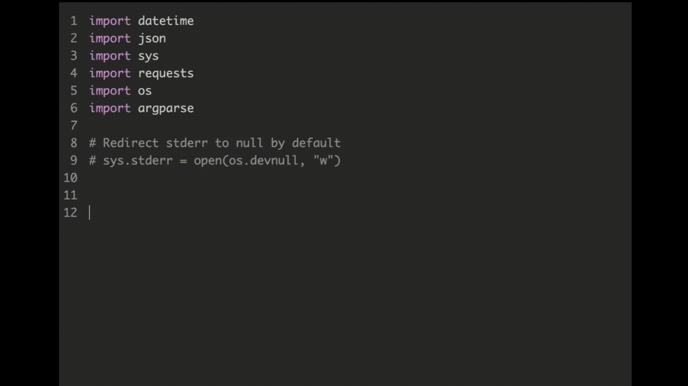
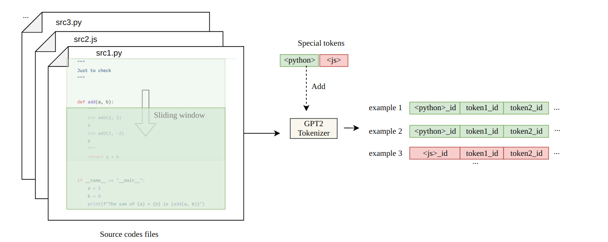
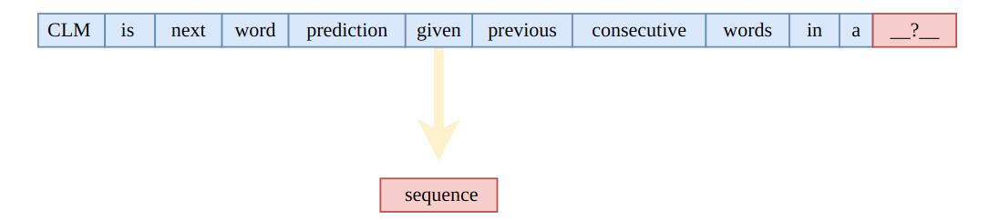

<h1 align="center"><p>IVolution Autocompleter</p></h1>

> An autocompleter for code editors based on [OpenAI GPT-2](https://github.com/openai/gpt-2).

### 🏠 [Homepage](https://ivolution.ai/)

**Ivolution** is an auto code completer for code editors (or any text editor) based on [OpenAI GPT-2](https://github.com/openai/gpt-2). It is trained (finetuned) on a curated list of approximately 45K Python (~470MB) files gathered from the Github. Currently, it just works properly on Python but not bad at other languages (thanks to GPT-2's power).



## Installation

### With Docker

Clone the repository:

```sh
git clone https://github.com/chelovekula/ivolutioncoding
```

Download the latest model from releases and uncompress it into the directory:

```sh
curl -SL https://github.com/chelovekula/ivolutioncoding/releases/latest/download/model.tar.xz | tar -xJC ./ivolutioncoding

```

Install dependencies:

```sh
pip3 install -r requirements.txt
```

P.S.: Be sure that you have tensorflow version >= 1.13

Run the autocompleter:

```sh
python3 main.py
```

## Usage

Currently, there are no extensions for code editors. You can use it through HTTP. When you run the `main.py`, it will serve an HTTP (flask) server. Then you can easily make a POST request to the http://localhost:3030/ with the some `JSON` body like the following:

```sh
{text: "your python code goes here"}
```

An example curl command:

```sh
curl -X POST \
  http://localhost:3030/autocomplete \
  -H 'Content-Type: application/json' \
  -d '{"text":"import os\nimport sys\n# Count lines of codes in the given directory, separated by file extension.\ndef main(directory):\n  line_count = {}\n  for filename in os.listdir(directory):\n    _, ext = os.path.splitext(filename)\n    if ext not"}'
```

Так же вы можете использовать плагин для VSCode [https://github.com/chelovekula/ivolutioncoding-vscode](https://github.com/chelovekula/ivolutioncoding-vscode) для более удобного тестирования в реальном времени.

## Finetuning The Model

Even you can finetune (re-train over) the model with/for your code files. Just follow the `Max Woolf's` [gpt-2-simple](https://github.com/minimaxir/gpt-2-simple) or `Neil Shepperd's` [gpt-2](https://github.com/nshepperd/gpt-2) repositories with **`345M`** version. But don't forget to replace checkpoint (model) with the one in this repository.

<h1 align="center"><p>Prepare Dataset</p></h1>

Мы знаем, что GPT-2 изначально был спроектирован для понимания естественного английского языка посредством предварительного обучения. Однако мы не должны ограничивать его применение только естественным языком. Другими словами, причина того, что он хорошо генерирует последовательные абзацы текста, заключается в том, что он хорошо «знает», как выводить следующую подсказку с учетом контекста в качестве ввода в последовательности. Текст просто соответствует шаблону, где следующая подсказка - это следующее слово, а контекст - это предыдущие слова в предложении.



С таким представлением легко предположить, что GPT-2 можно использовать для задач, включающих наборы данных, похожие на последовательность. Есть возможность решать задачи связанные с изображениями (например, [Image-GPT](https://openai.com/blog/image-gpt/)), если мы думаем об изображении, как о последовательности числовых пикселей. Задачи связанные с музыкой возможны, если мы думаем о музыкальном произведении как о последовательности нот, например [MuseNet](https://openai.com/blog/musenet/) .

Если мы подумаем о GPT-2 или любых других глубоких моделях с математической точки зрения то все сразу встает на свои места. Правда в том, что подобные модели просто знают числа и не знают таких вещей, как положение, лица, цвета или слова напрямую. Они могут знать разные слова косвенно, потому что разные слова представлены векторами (только разными числами) перед подачей в модели. Они знают позиции, потому что позиции перед подачей в модели представлены разными числами.

Коды языка программирования могут быть приняты как последовательные аналогичные данные, и, таким образом, GPT-2 может решать задачу подсказки кода.

Немного размышлений о подготовке датасета для решения задачи подскази кода.

Для этой цели существует много библиотек с открытым исходным кодом, которые предоставляют большие объемы кода. В качестве отправной точки можно на библиотеке [алгоритмов](https://github.com/TheAlgorithms) . Важно, чтобы модель помогала автоматически заполнять коды на общем уровне. Коды базовых алгоритмов подходят под эти нужды. Кроме того, я считаю, что коды из The Algorithms хорошо написаны (высококачественные коды). Так как задача требует, чтобы модель могла генерировать коды Python и JS, то для начала  можно просто клонировать соответствующие репозитории из The Algorithms. Затем стоит обратить внимание на заготовки сниппетов для IDE - так как они отлично подходят для файнтюнинга модели по 

## Задача

Необходимо взять за основу код веб сервера из этого проекта для сохранения обратной совместимости с плагином для VSCode.

Использовать [transformers](https://github.com/huggingface/transformershttps://github.com/huggingface/transformers) models library для выдачи данных из модели. В частности использовать GPT2Tokenizer.

Использовать [DeepSpeed](https://github.com/microsoft/DeepSpeedgithub.com/microsoft/DeepSpeed) для FineTuning модели.

В качестве основы по использованию и файнтюнигу модели можно использовать готовый плейграунд с коллаба https://colab.research.google.com/drive/1VYLdWyX6z0AuOdyBZbylogiweHPGbOBD#scrollTo=I7TAeZbRrYzFhttps://colab.research.google.com/drive/1VYLdWyX6z0AuOdyBZbylogiweHPGbOBD#scrollTo=I7TAeZbRrYzF

Нужно подготовить датасет для FineTuning модели [ruGPT3](https://github.com/sberbank-ai/ru-gpts) . Объем датасета должен соответсвовать выбранной модели (ruGPT3_large) и давать релевантные подскази при написании базовых конструкций кода (базовые циклы while\for, промисы и тп) - примерный объем датасета при условии что его качество при подборе соответствует оссобеностям энкодера - 400мб

Адаптировать бэкэнд текущей версии IvolutionCoding для работы с моделью ruGPT3_large.


На выходе необходимо что бы модель ruGPT3-large после FineTuning выдавала релевантные подсказки кода, взаимодействовала с бэкэндом, который в свою очередь умеет в рест-апи и выдает данные плагину для IDE
